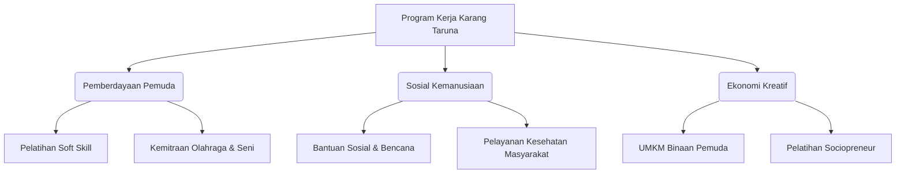
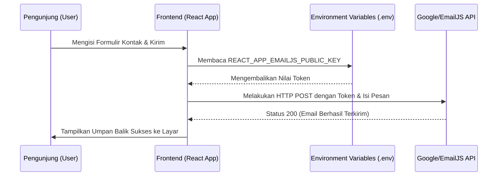
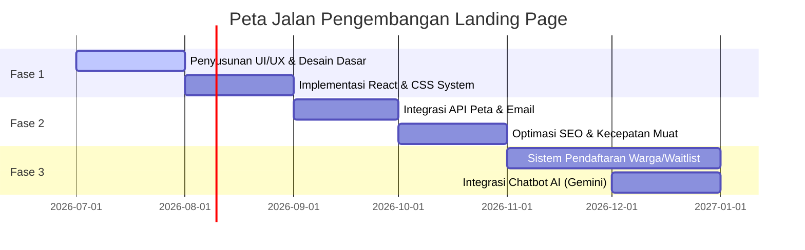

# DOKUMENTASI PROYEK: DIGITALISASI KARANG TARUNA SUKAMAJU
**Dokumen Spesifikasi Fungsional dan Teknis**  
*Versi Dokumen: 1.0.0*  
*Tanggal Rilis: 4 Juli 2026*  
*Status: Final / Siap Terap*  

---

## DAFTAR ISI
1. [Ringkasan Eksekutif](#1-ringkasan-eksekutif)
2. [Profil Organisasi (Karang Taruna Sukamaju)](#2-profil-organisasi-karang-taruna-sukamaju)
   - 2.1 [Visi dan Misi](#21-visi-dan-misi)
   - 2.2 [Pilar Program Kerja](#22-pilar-program-kerja)
3. [Arsitektur Informasi & Fitur Landing Page](#3-arsitektur-informasi--fitur-landing-page)
   - 3.1 [Struktur Halaman Utama (Sitemap)](#31-struktur-halaman-utama-sitemap)
   - 3.2 [Fungsionalitas Utama](#32-fungsionalitas-utama)
4. [Arsitektur Teknis & Pengembangan](#4-arsitektur-teknis--pengembangan)
   - 4.1 [Spesifikasi Teknologi (Tech Stack)](#41-spesifikasi-teknologi-tech-stack)
   - 4.2 [Struktur Direktori Proyek](#42-struktur-diretori-proyek)
   - 4.3 [Skema Environment Variables (`.env`)](#43-skema-environment-variables-env)
   - 4.4 [Arsitektur Aliran Data (Data Flow Diagram)](#44-arsitektur-aliran-data-data-flow-diagram)
5. [Panduan Instalasi & Penerapan (Deployment)](#5-panduan-instalasi--penerapan-deployment)
   - 5.1 [Prasyarat Sistem](#51-prasyarat-sistem)
   - 5.2 [Prosedur Eksekusi Lokal](#52-prosedur-eksekusi-lokal)
   - 5.3 [Prosedur Build & Distribusi Produksi](#53-prosedur-build--distribusi-produksi)
6. [Protokol Keamanan & Kepatuhan Data](#6-protokol-keamanan--kepatuhan-data)
7. [Peta Jalan (Roadmap) Pengembangan](#7-peta-jalan-roadmap-pengembangan)

---

## 1. RINGKASAN EKSEKUTIF

Proyek pembangunan **Landing Page Karang Taruna Sukamaju** bertujuan untuk mendigitalisasi profil, program kerja, serta layanan informasi dari organisasi kepemudaan Karang Taruna di tingkat Desa/Kelurahan Sukamaju. 

Melalui media digital ini, Karang Taruna Sukamaju berupaya meningkatkan transparansi publik, efisiensi komunikasi program kerja kepada masyarakat luas, dan mempermudah akses bagi pihak eksternal (kolaborator, sponsor, maupun warga lokal) untuk berinteraksi langsung. Secara teknis, platform ini dirancang dengan pendekatan modular berbasis pustaka React JS, memastikan kecepatan muat (page speed) yang optimal, kemudahan pemeliharaan (maintainability), dan skalabilitas untuk integrasi fitur di masa mendatang.

---

## 2. PROFIL ORGANISASI (KARANG TARUNA SUKAMAJU)

Karang Taruna Sukamaju adalah organisasi sosial wadah pengembangan generasi muda, yang tumbuh dan berkembang atas dasar kesadaran dan tanggung jawab sosial dari, oleh, dan untuk masyarakat terutama generasi muda di wilayah Desa Sukamaju.

### 2.1 Visi dan Misi
*   **Visi**: Mewujudkan generasi muda Desa Sukamaju yang aktif, mandiri, inovatif, berakhlak mulia, serta tanggap terhadap kesejahteraan sosial masyarakat.
*   **Misi**:
    1.  Menyelenggarakan kegiatan kepemudaan yang berfokus pada pengembangan soft skill dan wirausaha (sociopreneurship).
    2.  Membangun jaringan kemitraan yang strategis dengan sektor swasta, pemerintah daerah, dan akademisi.
    3.  Menyelenggarakan program pengabdian masyarakat secara berkala guna mendukung keharmonisan dan kesejahteraan warga Desa Sukamaju.

### 2.2 Pilar Program Kerja



---

## 3. ARSITEKTUR INFORMASI & FITUR LANDING PAGE

Landing page ini dirancang sebagai *Single Page Application (SPA)* dengan struktur navigasi yang intuitif untuk menjamin pengalaman pengguna (User Experience) yang berkelas premium.

### 3.1 Struktur Halaman Utama (Sitemap)
*   **Hero Section**: Sambutan visual interaktif dengan video/gambar resolusi tinggi, dilengkapi dengan teks ajakan bertindak (Call to Action / CTA) yang persuasif.
*   **Tentang Kami (About Us)**: Sejarah singkat, Visi-Misi, dan Galeri Kepengurusan (Struktur Organisasi).
*   **Program Kerja (Core Programs)**: Penjelasan mengenai 3 Pilar Program Kerja dengan visualisasi berbasis kartu (*card component*).
*   **Kegiatan Terbaru (News & Updates)**: Galeri foto dan dokumentasi kegiatan sosial atau program yang sedang berjalan.
*   **Kontak & Lokasi (Contact & Location)**: Peta interaktif, formulir pesan, tautan langsung ke media sosial, serta tombol hubungi via WhatsApp.

### 3.2 Fungsionalitas Utama

| Nama Fitur | Deskripsi | Target Pengguna | Metode Implementasi |
| :--- | :--- | :--- | :--- |
| **Contact Form** | Mengirimkan pesan/umpan balik langsung ke admin tanpa membuka aplikasi email. | Masyarakat & Mitra Kerja | Terintegrasi dengan EmailJS API / Formspree. |
| **Peta Lokasi** | Navigasi peta interaktif lokasi kantor sekretariat Karang Taruna. | Calon Mitra & Warga | Google Maps Embed / Mapbox SDK. |
| **Tautan WA Pintar** | Dial otomatis menuju chat WhatsApp dengan pesan templat yang sudah disiapkan. | Pengunjung Umum | API Whatsapp Link Formatter via environment variables. |
| **Live Chat** | Layanan dukungan pelanggan/warga secara real-time. | Warga yang membutuhkan bantuan | Widget Crisp / Tawk.to. |

---

## 4. ARSITEKTUR TEKNIS & PENGEMBANGAN

### 4.1 Spesifikasi Teknologi (Tech Stack)
*   **Library Utama**: React.js (Versi 19+) sebagai basis pembuatan antarmuka pengguna berbasis komponen.
*   **Runtime & Package Manager**: Node.js & NPM (untuk instalasi paket ketergantungan).
*   **Build Tooling & Scaffolding**: React Scripts (berbasis Webpack/Babel) untuk proses bundling yang andal.
*   **Styling**: CSS Vanilla dengan arsitektur variabel global (CSS Variables) untuk menjaga flexibilitas dan kustomisasi estetika.
*   **Integrasi Pihak Ketiga**:
    *   *Analitik*: Google Analytics 4 (GA4) untuk memantau trafik pengunjung.
    *   *Pengiriman Email*: EmailJS API (pemrosesan formulir tanpa backend).
    *   *Kecerdasan Buatan (Opsional)*: Google AI Studio (Gemini API) untuk integrasi chatbot asisten pemuda.

### 4.2 Struktur Direktori Proyek

```text
katarsukamaju/
├── public/                  # Aset statis & berkas HTML utama
│   ├── index.html           # Berkas template utama HTML
│   └── favicon.ico
├── src/                     # Berkas sumber aplikasi React
│   ├── components/          # Komponen modular yang dapat digunakan kembali (Header, Footer, Button)
│   ├── sections/            # Bagian-bagian halaman (Hero, About, Programs, Contact)
│   ├── styles/              # Kumpulan berkas styling CSS global & modular
│   ├── App.js               # Komponen entry point aplikasi utama
│   └── index.js             # Berkas inisialisasi React DOM
├── .env                     # File konfigurasi lokal (Diabaikan oleh Git)
├── .env.example             # Template variabel lingkungan untuk tim pengembang
├── .gitignore               # Daftar file/folder yang diabaikan oleh Git
└── package.json             # Manifes dependensi proyek dan skrip eksekusi
```

### 4.3 Skema Environment Variables (`.env`)

Seluruh kredensial API dan tautan sosial media diatur melalui variabel lingkungan eksternal agar kode program tetap aman dan dinamis. Berikut adalah daftar variabel yang digunakan dalam proyek ini:

```ini
# Metadata & Informasi Umum
REACT_APP_NAME="Katar Sukamaju"
REACT_APP_DESCRIPTION="Landing Page Karang Taruna Desa Sukamaju"
REACT_APP_URL="https://katarsukamaju.com"

# Layanan Pihak Ketiga (Analytics & Chat)
REACT_APP_GA_MEASUREMENT_ID="G-XXXXXXXXXX"
REACT_APP_CRISP_WEBSITE_ID="your-crisp-website-id-here"

# Penanganan Formulir & Email
REACT_APP_EMAILJS_SERVICE_ID="service_xxxxxxx"
REACT_APP_EMAILJS_TEMPLATE_ID="template_xxxxxxx"
REACT_APP_EMAILJS_PUBLIC_KEY="your_public_key_here"

# Kontak & Tautan Sosial Media (Dinamis)
REACT_APP_CONTACT_EMAIL="info@katarsukamaju.com"
REACT_APP_WHATSAPP_NUMBER="6281234567890"
REACT_APP_WHATSAPP_DEFAULT_TEXT="Halo Katar Sukamaju, saya ingin bertanya..."
REACT_APP_INSTAGRAM_URL="https://instagram.com/katarsukamaju"
```

### 4.4 Arsitektur Aliran Data (Data Flow Diagram)

Diagram berikut menjelaskan bagaimana interaksi antara frontend React, variabel lingkungan, dan layanan pihak ketiga:



---

## 5. PANDUAN INSTALASI & PENERAPAN (DEPLOYMENT)

### 5.1 Prasyarat Sistem
*   **Runtime Environment**: Node.js versi 18.0.0 atau yang lebih baru.
*   **Package Manager**: NPM versi 9.0.0 atau yang lebih baru (bawaan dari instalasi Node.js).
*   **Operating System**: Lintas Platform (Windows, macOS, Linux).

### 5.2 Prosedur Eksekusi Lokal

1.  **Kloning Repositori**:
    ```bash
    git clone https://github.com/username/katarsukamaju.git
    cd katarsukamaju
    ```
2.  **Konfigurasi Environment**:
    Salin file contoh konfigurasi menjadi file konfigurasi aktif lokal:
    ```bash
    cp .env.example .env
    # Buka berkas .env dan sesuaikan nilai variabel dengan kredensial lokal Anda
    ```
3.  **Instalasi Dependensi**:
    ```bash
    npm install
    ```
4.  **Menjalankan Server Pengembangan**:
    ```bash
    npm start
    ```
    *Aplikasi secara otomatis dapat diakses melalui peramban di alamat `http://localhost:3000`.*

### 5.3 Prosedur Build & Distribusi Produksi

Untuk melakukan kompilasi proyek menjadi aset statis siap pakai yang dioptimalkan untuk server produksi, jalankan perintah berikut:
```bash
npm run build
```
Proses ini akan menghasilkan direktori `/build` yang berisi berkas HTML, CSS, dan JS yang telah dimimifikasi (ukuran diperkecil) dan siap dideploy ke layanan hosting statis seperti:
*   Vercel
*   Netlify
*   GitHub Pages
*   Firebase Hosting

---

## 6. PROTOKOL KEAMANAN & KEPATUHAN DATA

1.  **Pemisahan Variabel Rahasia**: Seluruh kunci rahasia API disimpan dalam variabel lingkungan `.env`. File `.env` telah dimasukkan ke dalam berkas `.gitignore` untuk mencegah kebocoran kredensial ke ruang publik (seperti GitHub).
2.  **Sanitisasi Input Formulir**: Formulir kontak di sisi klien menggunakan modul validasi guna mencegah serangan Cross-Site Scripting (XSS) dan pemrosesan data kosong.
3.  **Akses Kunci Publik (Google AI Studio & GitHub PAT)**: Kunci API rahasia yang memerlukan tingkat keamanan tinggi disarankan untuk diakses melalui arsitektur serverless function di sisi server, guna mencegah pembajakan kuota dan penyalahgunaan kunci oleh pengguna luar.

---

## 7. PETA JALAN (ROADMAP) PENGEMBANGAN

Untuk memastikan kelangsungan dan peningkatan nilai manfaat platform di masa mendatang, berikut adalah rencana pengembangan jangka menengah dan panjang:



---
*Dokumen ini merupakan properti teknis Karang Taruna Sukamaju. Dilarang mendistribusikan ulang atau memodifikasi tanpa persetujuan tertulis dari pimpinan organisasi.*
